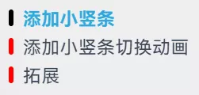

由于 Hexo-Theme-Fluid 主题（v1.8.14 之前）的目录前没有光标，所以想自己增加一个光标，并添加切换动画。

<!-- more -->

**注意：此内容已过时。Hexo-Theme-Fluid 主题自 v1.8.14 起添加了此功能。**

下面所描述的代码使用 `stylus` 格式，新建 `source/css/toc.styl` 文件，将代码复制进来，并在主题配置的 `custom_css` 添加文件路径 `/css/toc`（注意不带文件扩展名）。

## 添加光标

```stylus
// 光标依赖位置
.toc-body > ol {
  position: relative;
}

// 光标
.toc-list-item {
  // 伪元素
  &.is-active-li::before {
    // 伪元素内容，无需改动
    content: '';
    // 定位方式，无需改动
    position: absolute;
    // 左侧偏移量
    left: 0.25rem;
    // 光标高度
    height: 0.25rem;
    // 光标外边距
    margin: 0.625rem 0;
    // 光标宽度
    width: 0.25rem;
    // 光标圆角
    border-radius: 0.125rem;
    // 背景
    background: black;
  }
}
```

根据自己的需求，自行调整相应的数据。

注意：要想让光标垂直居中的话，可以让其“高度 `height` ”加上“外边距 `margin` 中的上下边距”等于“目录标题项 `.toc-list-item` ”的高度（默认值为 1.5rem）。比如上面的设置：$0.25+0.625\times2=1.5(rem)$ 。

## 添加光标切换动画

我们可以设置 `.toc-list-item::before` 的激活状态和初始状态，然后添加其过渡动画 `transition` 来实现切换效果。

首先将上面激活状态复制给初始状态：

```stylus
.toc-list-item {
  // 初始状态
  &::before {
    content: '';
    position: absolute;
    left: 0.25rem;
    height: 0.25rem;
    margin: 0.625rem 0;
    width: 0.25rem;
    border-radius: 0.125rem;
    // 这里为了演示更换一下颜色
    background: red;
  }
  // 激活状态
  &.is-active-li::before {
    content: '';
    position: absolute;
    left: 0.25rem;
    height: 0.25rem;
    margin: 0.625rem 0;
    width: 0.25rem;
    border-radius: 0.125rem;
    background: black;
  }
}
```

使用 `hexo server` 打开本地服务查看效果如下：



我们可以看到激活状态的光标（黑色）和初始状态的光标（红色）都显示出来了，我们不需要显示初始状态的光标，因此需要添加 `visibility` 属性，将初始状态的光标给隐藏掉，在初始状态中添加 `visibility: hidden;`。

为了实现切换效果，那就需要将初始状态和激活状态的一些属性设为不同，比如我的是将 `height` 和 `margin` 设为不同的值。

将具有不同值的属性加入到 `transition`，比如 `transition: height 0.2s ease-in-out, margin 0.2s ease-in-out, visibility 0.2s ease-in-out;` 。

> transition 的具体描述可以参见“[使用 CSS transitions](https://developer.mozilla.org/zh-CN/docs/Web/CSS/CSS_Transitions/Using_CSS_transitions)”。

可以把“激活状态”中与“初始状态”具有相同值的属性删除，至此光标的样式就全部完成了，最终结果如下：

```stylus
// 光标依赖位置
.toc-body > ol {
  position: relative;
}

// 光标
li.toc-list-item {
  // 初始状态
  &::before {
    content: '';
    position: absolute;
    left: 0.25rem;
    height: 0.25rem;
    margin: 0.625rem 0;
    width: 0.25rem;
    border-radius: 0.125rem;
    background: black;
    visibility: hidden;
    transition: height 0.2s ease-in-out, margin 0.2s ease-in-out, visibility 0.2s ease-in-out;
  }
  // 激活状态
  &.is-active-li::before {
    height: 1rem;
    margin: 0.25rem 0;
    visibility: visible;
  }
}
```

最终效果：


## 夜间模式

可以设置夜间模式下的颜色：

```stylus
[data-user-color-scheme='dark'] {
  .toc-list-item {
    &::before {
      background: orange;
      transition: background 0.2s ease-in-out;
    }
  }
}
```

## 拓展

更多主题美化参见“[Hexo-Fluid 博客美化和修改](/posts/f92be1eb/)”。
