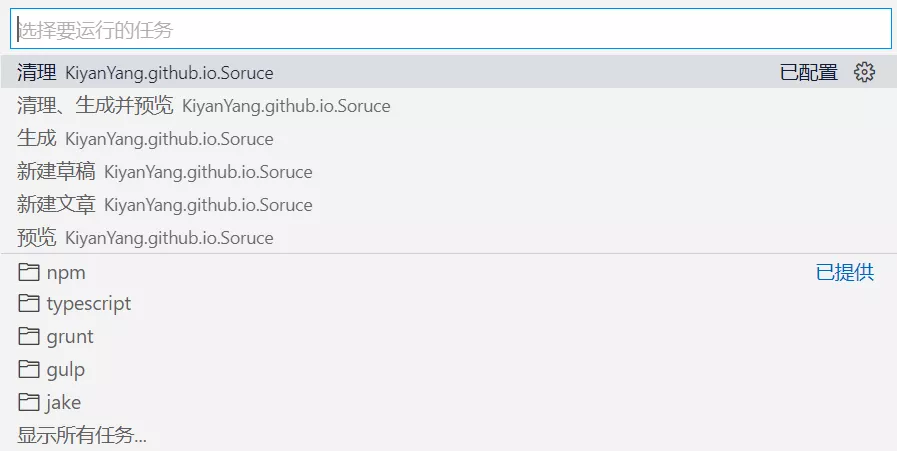

VS Code 的任务可以运行脚本和启动进程，通过配置任务文件进行重复性工作，可以大大提高效率。

本文章要实现目标是通过配置任务，可以使用 `Ctrl+Shift+B`（“运行生成任务”的快捷键）自动完成 Hexo 的清理、生成、开启本地预览，并且可以使用 VS Code 的“终端”菜单下的“运行命令”完成上述的单个命令。

<!-- more -->

## 配置 Tasks

> 工作区的特定任务是从 `Workspace` 的 `.vscode` 文件夹中的 `tasks.json` 文件配置。

### 新建 `tasks.json`

在 Hexo 工作区的 `.vscode` 文件夹下新建 `tasks.json` 文件。

### 配置单个 Hexo 命令

以 `hexo generate` 命令为例，在 `tasks.json` 粘贴下面的代码。

```json
{
  "version": "2.0.0",
  "tasks": [
    {
      // 任务类型。
      "type": "shell",
      // 任务的用户界面中使用的标签；相当于变量名。
      "label": "local generate",
      // 实际执行的命令。
      "command": "hexo generate",
      // 定义如何在用户界面中处理任务输出，自行定义。
      "presentation": {
        // 命令面板。dedicated -> 如果任务已在命令面板中则重用此面板，否则新建面板。
        "panel": "dedicated",
        // 任务执行前是否清理命令面板。
        "clear": true
      },
      // 问题匹配器，为空则不匹配任何问题。
      "problemMatcher": []
    }
  ]
}
```

代码中的参数根据注释和名称自行理解，想要查看更多的参数信息或关于 `Tasks` 的信息可以访问[官方文档](https://code.visualstudio.com/Docs/editor/tasks) 。

**备注**：上述任务中的 `presentation` 和 `problemMatcher` 是非必要的，但是实际使用时可以减少 VS Code 可能出现的询问次数。

### 配置多个 Hexo 命令

我们还需要按照上述增加其他命令，添加后的代码如下：

```json
{
  "version": "2.0.0",
  "tasks": [
    {
      "type": "shell",
      "label": "生成",
      "command": "hexo generate",
      "presentation": {
        "panel": "dedicated",
        "clear": true
      },
      "problemMatcher": []
    },
    // ----------
    // 新增代码
    {
      "type": "shell",
      "label": "清理",
      "command": "hexo clean",
      "presentation": {
        "panel": "dedicated",
        "clear": true
      },
      "problemMatcher": []
    },
    {
      "type": "shell",
      "label": "预览",
      "command": "hexo server",
      "presentation": {
        "panel": "dedicated",
        "clear": true
      },
      "problemMatcher": []
    }
    // ----------
  ]
}
```

**备注**：`tasks` 内的任务书写无顺序之分。

### 配置多个命令的顺序执行

代码如下：

```json
{
  "version": "2.0.0",

  "tasks": [
    // ----------
    // 新增代码。
    {
      "label": "清理、生成并预览",
      // 执行顺序。sequence -> 顺序依次执行。
      "dependsOrder": "sequence",
      // 执行本任务前要执行的任务。在此处依次写入其他任务的标签（label）。
      "dependsOn": ["清理", "生成", "预览"],
      "problemMatcher": [],
      // 组。
      "group": {
        // 任务类型。
        "kind": "build",
        // 是否为默认任务。
        "isDefault": true
      }
    },
    // ----------
    {
      "type": "shell",
      "label": "清理",
      "command": "hexo clean",
      "presentation": {
        "panel": "dedicated",
        "clear": true
      },
      "problemMatcher": []
    },
    {
      "type": "shell",
      "label": "生成",
      "command": "hexo generate",
      "presentation": {
        "panel": "dedicated",
        "clear": true
      },
      "problemMatcher": []
    },
    {
      "type": "shell",
      "label": "预览",
      "command": "hexo server",
      "presentation": {
        "panel": "dedicated",
        "clear": true
      },
      "problemMatcher": []
    }
  ]
}
```

其中本例内 `group` 的设置是为了将任务 `local clear & server` 设置为 VS Code “运行生成任务...”功能的默认任务，这样我们才能通过快捷键 `Ctrl+Shift+B` 执行此任务。

**备注**：新增的这个任务是一个自身不执行任何命令的任务。

## 执行 Tasks

完成上面的设置后，我们在编辑了 Hexo 的文章或其他内容后使用 `Ctrl+Shift+B` 快捷键就可以自动完成 Hexo 的清理、生成、开启本地预览。

如果想要执行上面配置的 3 个任务中的某一个，可以点击菜单栏“终端”下的“运行任务”来执行其中的任务。



如果最近任务里没有自己定义的任务，可以点击最下方的“显示所有任务...”来查看所有定义的任务。

## 疑问与解答

1. 为什么要创建 4 个任务，而不是将最后任务的依赖设为前两个，这样就只会有 3 个任务（比如如下代码），这难道不是更简洁吗？

   ```json
   {
     "version": "2.0.0",
     "tasks": [
       {
         "type": "shell",
         "label": "清理",
         "command": "hexo clean",
         "presentation": {
           "panel": "dedicated",
           "clear": true
         },
         "problemMatcher": []
       },
       {
         "type": "shell",
         "label": "生成",
         "command": "hexo generate",
         "presentation": {
           "panel": "dedicated",
           "clear": true
         },
         "problemMatcher": []
       },

       // 最后一个任务执行前先执行其他两个
       {
         "type": "shell",
         "label": "预览",
         "command": "hexo server",
         "presentation": {
           "panel": "dedicated",
           "clear": true
         },
         "problemMatcher": [],
         "dependsOrder": "sequence",
         "dependsOn": ["清理", "生成"],
         "group": {
           "kind": "build",
           "isDefault": true
         }
       }
     ]
   }
   ```

   **解答**：这样设置会导致无法使用单一的命令 `hexo server`，因为调用 `local server` 这个任务总会调用其他两个。当然如果你不需要有单独执行命令 `hexo server` 的任务，那你这样写也可以。

2. 只能通过 `shell` 类型的任务来完成本次的目标吗？
   **答**：当然不是，你也可以使用 `npm` 等类型的任务来完成目标。

## 附录

你也可以参考上面的任务，自己添加 Hexo 的任务，比如一键部署等。

关于我 Hexo 的 `tasks.json` 可以参见 [VS Code 中关于 Hexo 的任务（Tasks）](/posts/5a271947/)。

## 参考

- VS Code docs
  - [Integrate with External Tools via Tasks](https://code.visualstudio.com/docs/editor/tasks)
- Hexo docs
  - [Commands](https://hexo.io/docs/commands)
