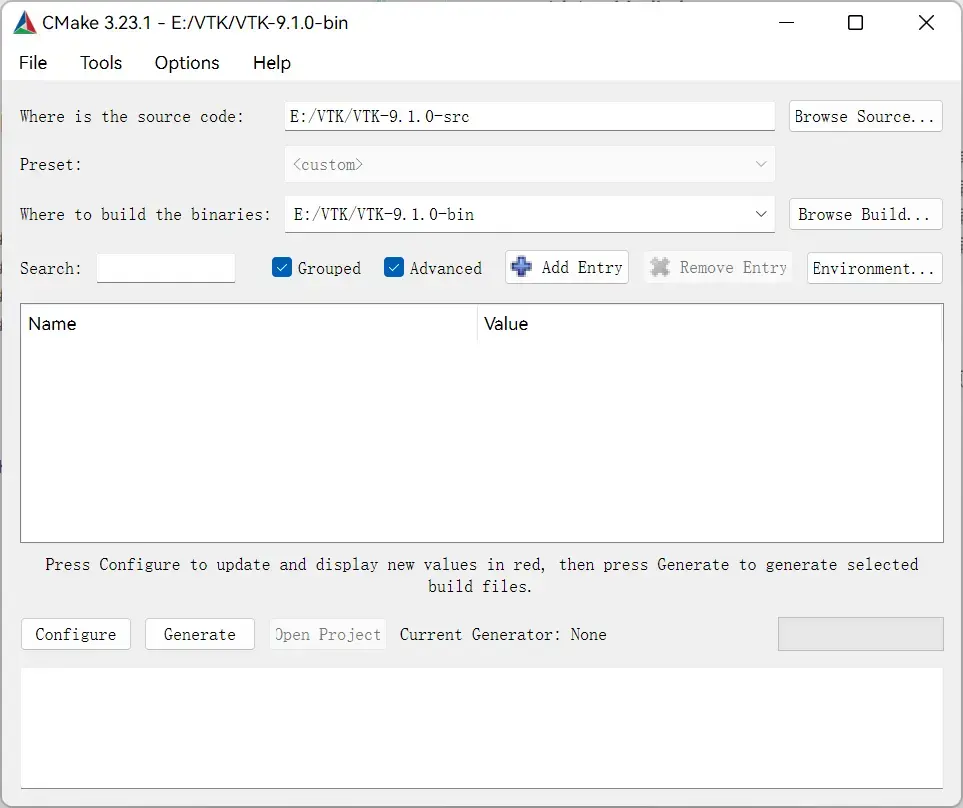
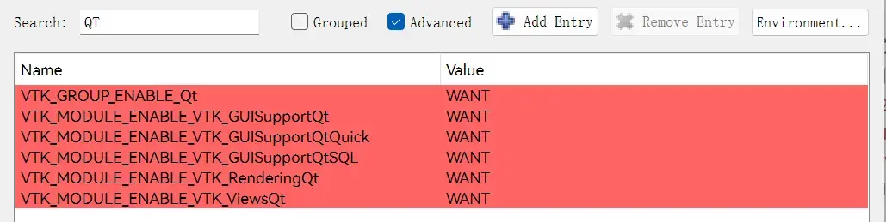
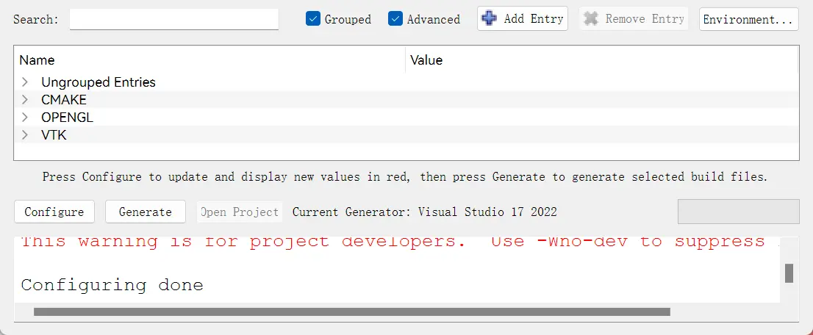
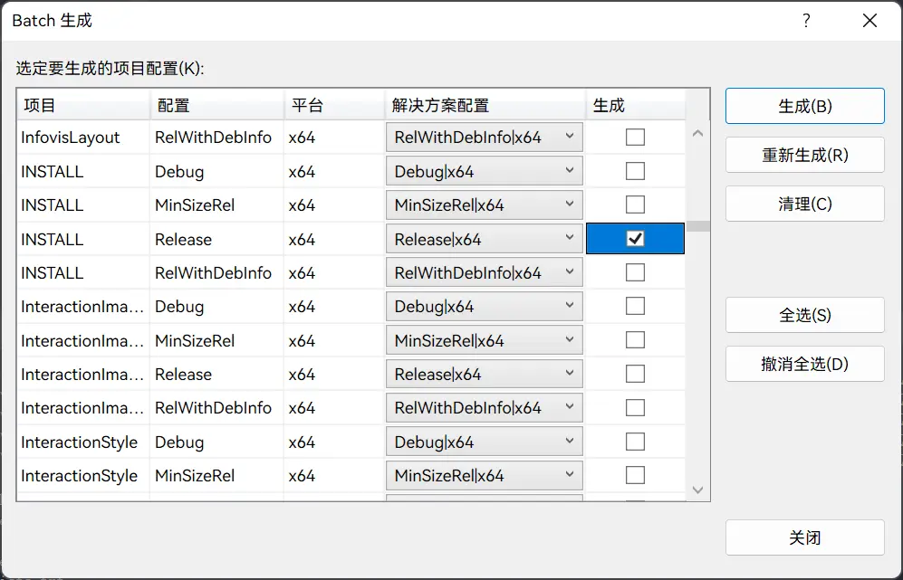

本文在 Windows11 平台使用 Visual Studio 2022 编译 VTK 9.1.0。

<!-- more -->

## 前置条件

本文所需文件或工具：

|     文件或工具     |  版本  |                     网址                      |
| :----------------: | :----: | :-------------------------------------------: |
|      VTK 源码      | 9.1.0  |           https://vtk.org/download/           |
| Visual Studio 2022 | 17.2+  | https://visualstudio.microsoft.com/downloads/ |
|       CMake        | 3.23.1 |          https://cmake.org/download/          |
|         Qt         |  5.12  |          https://www.qt.io/download           |

注意：所需工具均为 **64** 位。

## 编译前准备

在编译之前先准备好编译过程中所需的目录。目录结构如下：

```txt
VTK
├─ VTK-9.1.0-src                  # 源码
├─ VTK-9.1.0-bin                  # 编译生成的二进制数据
├─ VTK-9.1.0-vs2022-x64-debug     # 编译生成的库文件
└─ VTK-9.1.0-vs2022-x64-release   # 编译生成的库文件
```

## CMake 编译

打开 CMake (cmake-gui)，设置 VTK 源码和生成的二进制路径，点击 `Configure`。



在配置对话框，选择 Visual Studio 17 2022，其他保持默认，点击 `Finish`。


在配置完成后，会出现一些红色条目，表示需要进一步处理，这是正常现象，无需担心。

在左上角搜索框搜索 `BUILD_SHARED_LIBS`，将其勾选。此项的作用是生成动态共享库 DLL。


搜索 `CMAKE_INSTALL_PREFIX`，设置为 VTK 库要安装的位置，即 VTK 编译后的库文件位置。由于该项在设置后不可改变，因此为了可以同时生成 Debug 和 Release 两个版本，可以将该项设置为 `VTK-9.1.0-vs2022-x64-debug` 文件夹的路径。因为生成的库文件总是在 `VTK-9.1.0-vs2022-x64-debug` 文件夹，这样我们只需先生成 Release 模式下的库文件，然后将文件剪切到 `VTK-9.1.0-vs2022-x64-release` 文件夹，之后再生成 Debug 模式下的库文件即可。


搜索 `QT`，将所有条目设为 `Want`，点击 `Configure`。



在配置完成后，选择 Qt5 的位置，路径为 `Qt_DIR/5.12.0/msvc2017_64/lib/cmake/.*`，如下图所示（一般情况下，CMake 会自动填入）。


搜索 `VTK_QT_VERSION`，设置为 5，点击 `Configure`。


在配置完成后，所有条目均为白色，说明没有错误。如果还是有红色，请返回检查，直到全白。点击 `Generate`。



在生成完成后，所有条目均为白色，说明没有错误。点击 `Open Project`，打开 VS2022。


## VS2022 编译

选择「生成 -> 批生成」。


在「Batch 生成」对话框，勾选 ALL_BUILD Release x64，点击生成，生成大约需要 40 分钟。


等待生成完毕，之后再次进入「Batch 生成」对话框，取消勾选上述 ALL_BUILD Release x64，然后勾选 INSTALL Release x64，点击生成。




此时，VTK-9.1.0-vs2022-x64-debug 文件夹内就是 VTK 9.1.0 Release 版本的库文件，将其剪切到 VTK-9.1.0-vs2022-x64-release 文件夹，就完成了 Release 版本的构建，最终 VTK-9.1.0-vs2022-x64-release 目录结构如下：

```txt
VTK-9.1.0-vs2022-x64-release
├─ bin
├─ include
├─ lib
└─ share
```

生成 Debug 模式下的库文件和上述过程相似。首先，取消勾选 INSTALL Release x64，然后勾选 ALL_BUILD Debug x64 和 INSTALL Debug x64，点击生成，就会在 VTK-9.1.0-vs2022-x64-debug 文件夹里生成库文件。

## 参考

- [VTK9.1.0 在 Windows10 + VS2019 + Qt 5.15.2 环境下编译安装以及 VTK 应用于 QT](https://blog.csdn.net/qq_34499305/article/details/120774663)
- [VTK8.2.0 在 Windows10 + VS2017 + Qt 5.12 环境下编译安装](https://blog.csdn.net/annjeff/article/details/88597051)
